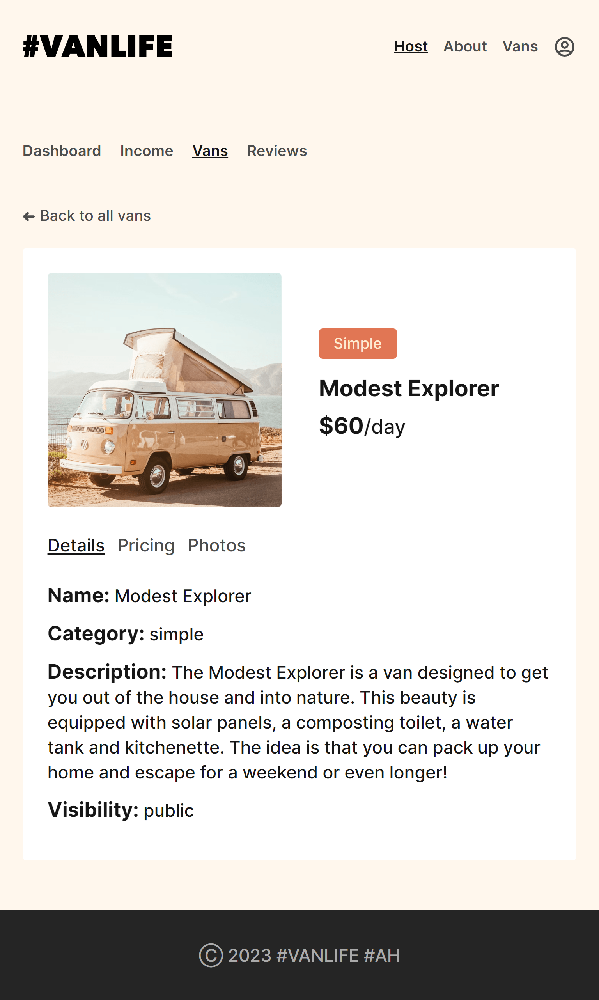

# VANLIFE

Vanlife is A web application that allows people to rent out camp vans for their next road trip adventure.

VAN-LIFE V.1

in V.2 we add: defer, Await, and Suspense To handle some loading because we using a loader instead useEffect() hook and add real authentication

See the project here: https://vanlife-d137c.web.app

LinkedIn : https://www.linkedin.com/in/ahmed-heikal-875175236

# Features

- SPA with 10+ routes
- Responsive Design (mobile - tablet - desktop)
- Using loader (API data layer) faster 3x times
- Using Link State
- Filter by van type (query params)
- Using Relative Path and Link
- Active navLink styling
- Protected routes
- Nested routes (multiple levels deep)
- Using a real database (Firebase)

# Tech Stack

- React Library
- React Router v.6 
- Firebase(Firestore db)
- HTML - CSS - JS

# Home Page

# Vans Page

# Dashboard Page

# Filtered page

# HostVan page

